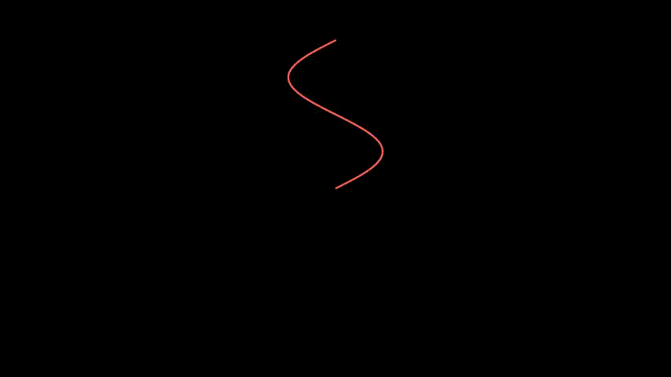

```python
class ExampleAddUpdater(Scene):
    def construct(self):
        def func():
            param = ParametricFunction(
                lambda u: np.array([
                    np.sin(2*u),
                    u ,
                    0
                ]), color=RED, t_min=0, t_max=PI)
            return param
        curve = func()
        def update_curve(d,dt):
            d.rotate_about_origin(dt)
        def update_curve_back(d,dt):
            d.rotate_about_origin(-dt)
        curve.add_updater(update_curve)
        self.add(curve)
        self.wait(PI/2)
        curve.remove_updater(update_curve)
        curve.add_updater(update_curve_back)
        self.wait(PI/2)
```
