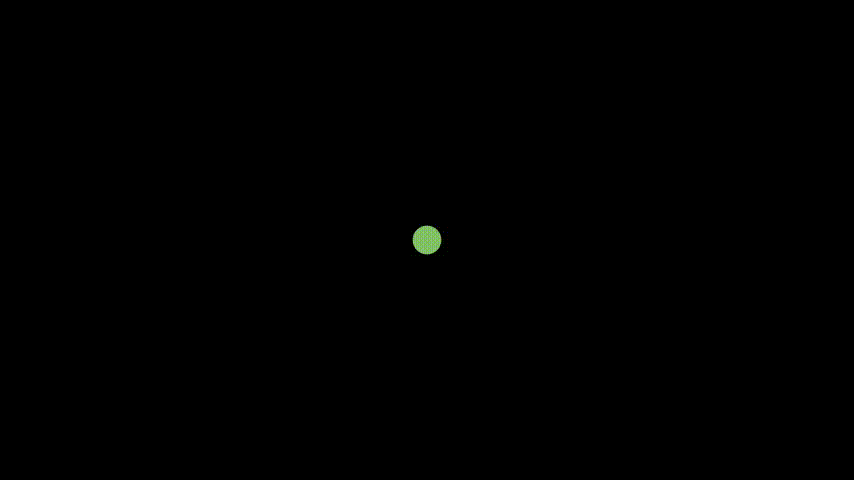

# Learning by Examples addUpdater and UpdateFromFunc
```python
class ExampleAddUpdater(Scene):
    def construct(self):
        def func():
            param = ParametricFunction(
                lambda u: np.array([
                    np.sin(2*u),
                    u ,
                    0
                ]), color=RED, t_min=0, t_max=PI)
            return param
        curve = func()
        def update_curve(d,dt):
            d.rotate_about_origin(dt)
        def update_curve_back(d,dt):
            d.rotate_about_origin(-dt)
        curve.add_updater(update_curve)
        self.add(curve)
        self.wait(PI/2)
        curve.remove_updater(update_curve)
        curve.add_updater(update_curve_back)
        self.wait(PI/2)
```


```python
class ExampleAddUpdater2(Scene):
    def construct(self):
        path = VMobject()
        dot = Dot()
        path.set_points_as_corners([dot.get_center(),dot.get_center()])
        def update_path(path):
            previus_path = path.copy()
            previus_path.add_points_as_corners([dot.get_center()])
            path.become(previus_path)

        path.add_updater(update_path)

        self.add(path,dot)
        self.play(
            Rotating(
                dot,
                radians=PI,
                about_point=RIGHT,
                run_time=2
            )
        )
        self.wait(0.2)
        self.play(
            dot.shift,UP
        )
        self.play(
            dot.shift,LEFT
        )
        self.wait()
```


```python
class ExampleAddUpdater3(Scene):
    def construct(self):
        dot = Dot()

        def func(t):
            return np.array((np.sin(2 * t), np.sin(3 * t), 0))

        func = ParametricFunction(func, t_max=TAU, fill_opacity=0)
        func.scale(2)

        # This Class return a VGroup of pieces of the path
        new_func = CurvesAsSubmobjects(func)
        new_func.set_color_by_gradient(BLUE,RED)
        # It is more efficient to use this method in this case.
        dot.add_updater(lambda m: m.move_to(func.get_end()))

        # What we are doing is creating a new path,
        # and the original make it transparent,
        # so that from the illusion that the original is being drawn.
        func.fade(1)
        self.add(dot)

        self.play(
            ShowCreation(new_func),
            ShowCreation(func),
            run_time=5
        )
        self.wait()
```


```python
class ExampleUpdateFromFunc1(Scene): #Two Options to update a scene one more nested, one more explicit
    def construct(self):
        tick_start=0
        tick_end=100
        val_tracker= ValueTracker(tick_start)
        dot_disp= Dot()
        self.add(dot_disp)
        # version A
        def small_change(dot_disp,val_tracker):
            dot_disp.shift(UP * 0.001 * val_tracker.get_value())
            print(dot_disp.get_center()[1])
            return dot_disp
        self.play(
            UpdateFromFunc(
                dot_disp,
                lambda mob: mob.become(small_change(dot_disp,val_tracker))),
            val_tracker.set_value,tick_end, rate_func= linear
        )
        #  version B
        val_tracker= ValueTracker(tick_start)
        def Tiny_Updater(dots,val_trackerX):
            def small_change2(mob):
                mob.shift(DOWN * 0.001 * val_trackerX.get_value())
                return mob
            return UpdateFromFunc(dots, small_change2)
        self.play(Tiny_Updater(dot_disp,val_tracker),val_tracker.set_value,tick_end)
        self.wait()
```


```python
class ExampleUpdateFromFunc2(Scene):

    def construct(self):
        run_setting = {"run_time": 1, "rate_func": linear}
        tick_start = 0
        tick_end = 100
        val_tracker= ValueTracker(tick_start)
        dot_disp= Dot().scale(3).set_color(GREEN)
        self.add(dot_disp)
        def Tiny_Updater(dots,val_trackerX):
            def small_change2(mob):
                mob.move_to(DOWN * 0.01 * val_trackerX.get_value())
                print(val_trackerX.get_value())
                return mob
            return UpdateFromFunc(dots, small_change2)


        tick_start = 0
        tick_end = 100
        self.play(Tiny_Updater(dot_disp,val_tracker),val_tracker.set_value,tick_end,**run_setting)
        self.wait()
        tick_end = 200
        self.play(Tiny_Updater(dot_disp,val_tracker),val_tracker.set_value,tick_end,**run_setting)
```

